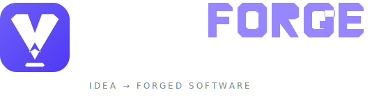

<div align="center">

  <picture>
    <source media="(prefers-color-scheme: dark)" srcset="./src/assets/brand/lockup-dark.svg">
    <source media="(prefers-color-scheme: light)" srcset="./src/assets/brand/lockup-light.svg">
    
  </picture>

  <h3 align="center">Turn Ideas Into Software Blueprints — Instantly</h3>

  <p align="center">
    AI-powered project discovery & blueprint generation
    <br />
    <a href="https://github.com/Farmeobaasje/vibeforge"><strong>Explore the docs »</strong></a>
    <br />
    <br />
    <a href="#-features">Features</a>
    ·
    <a href="#-quick-start">Quick Start</a>
    ·
    <a href="#-demo">Demo</a>
    ·
    <a href="https://github.com/Farmeobaasje/vibeforge/issues">Report Bug</a>
    ·
    <a href="https://github.com/Farmeobaasje/vibeforge/issues">Request Feature</a>
  </p>

  <p align="center">
    <a href="https://github.com/Farmeobaasje/vibeforge/blob/main/LICENSE">
      
    </a>
    <a href="https://github.com/Farmeobaasje/vibeforge/actions">
      
    </a>
    <a href="https://github.com/Farmeobaasje/vibeforge/releases">
      
    </a>
    <a href="https://www.typescriptlang.org/">
      
    </a>
    <a href="https://react.dev/">
      
    </a>
    <a href="https://vite.dev/">
      
    </a>
    <a href="https://tailwindcss.com/">
      
    </a>
  </p>

  <p align="center">
    <a href="https://www.buymeacoffee.com/lynoa" target="_blank">
      
    </a>
  </p>

</div>

---

## 🧠 What is VibeForge?

**VibeForge** is an AI-powered web application that interviews you about your project idea and generates a complete, structured software project blueprint — including architecture documentation, technical specifications, Memory Bank, Cline rules, and bootstrap prompts.

Think of it as your **AI software architect**: you describe your idea, VibeForge asks smart follow-up questions, analyzes your requirements, and produces a production-ready project definition that you can immediately use with AI coding assistants like Cline, Cursor, or Claude.

---

## ✨ Features

| Feature | Description |
|---------|-------------|
| **🎙️ AI-Powered Interview** | 6-step wizard that asks intelligent questions about your project vision, users, architecture, and roadmap |
| **🧩 17 Domain Templates** | Pre-built templates for marketplace, restaurant, CRM, fitness, healthcare, education, SaaS, and more |
| **🤖 7 AI Providers** | OpenAI, Anthropic, Google, DeepSeek, OpenRouter, Local, and Mock — you choose |
| **⚡ Deterministic + AI Generation** | Fast deterministic generation with AI fallback for complex cases |
| **📦 Complete Blueprint Export** | Generates PRD, SPEC, Memory Bank, Cline rules, bootstrap prompts, and architecture docs |
| **🎯 Semantic Domain Classification** | Automatically detects your project domain from keywords with weighted scoring |
| **🔍 Architecture Insights** | AI-powered architecture review with risk analysis and recommendations |
| **🌙 Dark/Light Theme** | Full design system with system-aware theme switching |
| **🎮 Guided Tour** | Interactive demo with BioBatch Sentinel — a complete scripted scenario |
| **📋 Golden Test Suite** | 8 fixed test projects with snapshot-based regression testing |
| **💾 Local Storage** | All data persists in your browser — no server required |

---

## 🚀 Quick Start

### Prerequisites

- **Node.js** >= 20.x
- **npm** >= 10.x

### Installation

```bash
# Clone the repository
git clone https://github.com/Farmeobaasje/vibeforge.git
cd vibeforge

# Install dependencies
npm ci

# Start the development server
npm run dev
```

Open [http://localhost:5173](http://localhost:5173) in your browser.

### Production Build

```bash
npm run build
npm run preview
```

---

## 🎮 Demo

VibeForge ships with a **Guided Tour** featuring **BioBatch Sentinel** — a complete scripted interview scenario for a biotech lab operations platform. Click the "Guided Tour" button on the landing page to experience the full workflow without typing a single word.

---

## 🧱 Why I Built VibeForge

VibeForge started from a very personal place.

I worked in construction for years. It was the craft I knew, the work I was used to, and the world I came from.

In 2019, I was involved in a serious car accident. Recovery took several years. From 2023 to 2026, I worked hard to return to construction and rebuild my life around physical work again.

But over time, it became clear that my body could no longer keep up with that kind of work.

During those years, programming became more than a hobby. It became a new craft.

AI helped me learn faster, experiment more, and turn ideas into real software. But while building projects with AI coding assistants, I kept running into the same problem:

Every project started with rebuilding the same context.

The same planning.

The same documentation.

The same architecture decisions.

The same prompts.

The same project rules.

So I built VibeForge.

Not as another AI coding assistant, but as the workspace before the coding starts — a place where raw ideas become structured software blueprints that AI tools can actually work with.

VibeForge represents a new chapter for me: building with software instead of construction materials, and sharing the tools I wish I had when I started.

It is free and open source because I want other builders to use it, learn from it, and improve it.

If VibeForge helps you start even one project with more clarity, then it has already done its job.

---

## 🧩 Domain Templates

VibeForge includes **17 domain-specific templates** that influence taglines, architecture patterns, entities, roadmaps, and data flows:

| Domain | Description |
|--------|-------------|
| Marketplace | Online marketplace connecting buyers and sellers |
| Restaurant | Restaurant management system |
| CRM | Customer relationship management |
| Fitness | Fitness and wellness platform |
| Construction | Construction project management |
| Agency | Digital agency management |
| Healthcare | Healthcare practice management |
| Education | Educational platform |
| AI SaaS | AI-powered SaaS platform |
| AI SaaS Support | AI SaaS customer support |
| Emulator | Emulator/VM platform |
| Plumbing | Plumbing service management |
| Project Management | Project management tool |
| Travel | Travel booking platform |
| Solar Energy | Solar energy platform |
| Website | Business website |
| Generic | Fallback for any other domain |

---

## 🏗 Architecture

```
src/
├── ai/              # AI provider abstraction layer (7 providers)
│   ├── providers/   # OpenAI, Anthropic, Google, DeepSeek, OpenRouter, Local, Mock
│   ├── architect/   # AI architect agent
│   └── interview/   # AI interview agent
├── canonical/       # Canonical data model & resolvers
├── components/      # React UI components (30+)
│   └── GuidedTour/  # Interactive demo system
├── demo/            # BioBatch Sentinel demo scenario
├── generator/       # Deterministic + AI fallback generation pipeline
├── hooks/           # React hooks (11)
├── intelligence/    # Domain classification & LLM extraction
├── lib/             # Utilities (storage, export, theme, etc.)
├── models/          # Data models (workspace, memory, requirements, etc.)
├── orchestrator/    # Interview state machine & conversation engine
├── semantic/        # 17 domain templates with keyword scoring
├── types/           # TypeScript type definitions
└── __tests__/       # Golden test suite + snapshot tests
```

---

## 🛠 Tech Stack

| Technology | Version |
|------------|---------|
| [React](https://react.dev/) | ^19.2.7 |
| [Vite](https://vite.dev/) | ^8.1.0 |
| [TypeScript](https://www.typescriptlang.org/) | ~6.0.2 |
| [Tailwind CSS](https://tailwindcss.com/) | ^4.3.1 |
| [Vitest](https://vitest.dev/) | ^4.1.9 |
| [Oxlint](https://oxc.rs/) | ^1.69.0 |

---

## 🤝 Contributing

Contributions are what make the open-source community such an amazing place. Any contributions you make are **greatly appreciated**.

See [CONTRIBUTING.md](./CONTRIBUTING.md) for the full contribution guide.

### Quick Start for Contributors

```bash
# Fork the repo, then clone your fork
git clone https://github.com/your-username/vibeforge.git
cd vibeforge

# Install dependencies
npm ci

# Run tests
npm test

# Run linter
npm run lint
```

---

## 📜 License

Distributed under the **MIT License**. See [LICENSE](./LICENSE) for more information.

---

## ☕ Support

VibeForge is free and open source.

There are no subscriptions, no locked features, and no enterprise edition.

I build this project independently, in my own time, while transitioning into software development as a new career path.

If VibeForge saves you time or helps you build better projects, you can support its development here:

<a href="https://www.buymeacoffee.com/lynoa" target="_blank">
  
</a>

A coffee helps.  
A kind message helps.  
A GitHub star helps.  
And if that coffee also helps with this week's groceries, I appreciate it more than you know.

Thank you for supporting VibeForge. ❤️

---

## 🙏 Acknowledgments

- Built with [React](https://react.dev/), [Vite](https://vite.dev/), and [Tailwind CSS](https://tailwindcss.com/)
- AI providers: [OpenAI](https://openai.com/), [Anthropic](https://anthropic.com/), [Google](https://ai.google/), [DeepSeek](https://deepseek.com/), [OpenRouter](https://openrouter.ai/)
- Inspired by the AI-assisted development workflow

---

<p align="center">
  Made with ❤️ by <a href="https://github.com/Farmeobaasje">Farmeobaasje</a>
</p>
